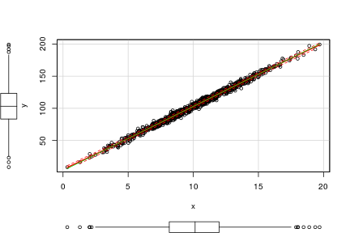
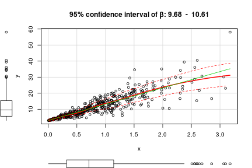

Linear Model Sim
========================================================
author: Marcello Passarelli
date: 9 May 2016

App presentation
========================================================

The Linear Model Simulation app creates a normally distributed independent variable (x). According to the parameters specified by the user, it then creates a dependent variable y. The linear model y ~ x is fitted and plotted, along with the confidence interval for the linear coefficient beta. 

Along with the model's parameters, the user can specify various assumptional violations to experiment and see how they impact model fit. 

Example
========================================================


```r
x <- rnorm(1000, mean=10, sd=3)
y <- 3 + x*10 + rnorm(1000, sd=3) # model
scatterplot(y ~ x)
```

 

Here, for example, we see the simplest case (a linear model with no assumption violations)

Example 2
========================================================
 

Here is an example with the omoschedasticity assumption violated: the variance of the error term is not constant, but is linearly dependent on x. 

The app
========================================================
Some combination of assumptional violations lead to unreliable confidence intervals for the beta parameter; sometimes wildly so. 
Experiment a little and see how the model can be broken :)

Here is the app: 
[Linear Model Sim](https://mpass.shinyapps.io/ShinySim/)

And here is its Github repository, which includes this very presentation: 
[Github Repo](https://github.com/M-Pass/LinearSim)
